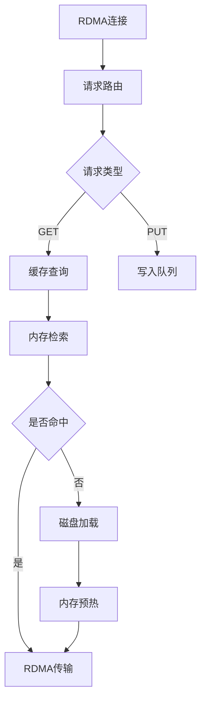

项目名称：Helios Calculation
副标题：一个内存中心式的、硬件感知的分布式 AI 计算平台

1. 架构定义 (Architecture Definition)
Helios Calculation 采用一种创新的内存中心式 (Memory-Centric) 架构，其核心是一个拥有海量内存和超高带宽的控制器 (Controller)，以及一组部署在高性能计算节点（如 IBM AC922）上的轻量级代理 (Agent)。

该架构将整个计算集群（包括 Controller 的内存）抽象为一个统一的、分层的内存资源池，并通过 Controller 主导的、基于数据特性的智能调度，为上层的大规模并行训练框架（如 Megatron-LM）提供极致的性能和无与伦比的稳定性。

其核心是两层分布式模型与三层网络架构的深度融合：

宏观分布式 (Controller -> Agents): Controller 作为唯一的“主宰”，负责将模型和数据在逻辑上切分，并分发给物理上分散的 NUMA 容器。

微观分布式 (Megatron-LM within NUMA): 在单个 NUMA 容器内部，Megatron-LM 框架负责对其管辖的多块 GPU 进行二次的、硬件层面的微观分布式。

NUMA 容器生命周期 (NUMA Container Lifecycle)
Helios Calculation Agent 的核心职责是管理其所在节点上所有 NUMA 容器的完整生命周期。这个过程由 Controller 远程触发和协调，确保了资源分配的精确性和隔离性。

指令接收: Agent 从 Controller 接收到一个启动容器的 RPC 请求，其中包含所有必要的参数。

镜像拉取: Agent 调用本地的容器引擎（如 Docker/Podman），从指定的仓库拉取 Megatron-LM 运行环境镜像。

硬件绑定与启动: Agent 根据指令中的参数，构造并执行一条精确的 docker run 命令，将容器实例严格地绑定在指定的硬件资源上。

状态监控: 容器启动后，Agent 持续监控其健康状况、资源使用情况，并实时上报给 Controller。

生命周期管理: Agent 负责容器的停止、重启和销毁，并清理相关资源。

2. 功能特性 (Features)
Controller 主导的初始化: 由 Controller 统一加载、切分并分发模型，彻底取代传统由 Rank 0 计算节点承担主控的脆弱模式。

三层共享缓存架构:

L1 缓存: 节点内 GPU 显存，作为最高性能的稳定区。

L2 缓存: 节点内 CPU 主机内存，用于存放高流动性数据。

L3 缓存: Controller 自身的海量内存，作为全局共享的温/冷数据缓存池。

NUMA 为中心的资源管理: 所有调度和资源绑定都以 serverId:numaId 为基本单位，确保极致的硬件亲和性。

数据特性感知调度: 数据块被赋予“热度、温度、流动性、稳定性”等属性，策略引擎基于这些属性动态决定数据在三层缓存中的最佳驻留位置。

读写路径分离与动态路由: 根据传输类型和数据特性，动态选择 RDMA (低延迟) 或 ZMQ (高带宽) 等最优传输路径。

三层高性能网络架构:

数据主干网 (Data Backbone): 基于非对称的 RoCE 网络，Controller 端配置海量带宽（如 10 x 双口 100G），而各计算节点配置标准带宽（1 x 双口 100G）。专用于 L3 缓存读取和 GDR 协调，通过上下行端口分离实现流量隔离。

数据迁移网 (Migration Fabric): 基于每个 NUMA 节点专属的 200G QSFP 网卡，构建跨服务器的 L2 缓存（主机内存）数据迁移通道，完全旁路 Controller，极大降低其网络负载。

管理网 (Management Plane): 基于低带宽的 2.5G RJ45 网口，负责心跳、遥测、评分等轻量级控制信令，确保核心数据网络不受干扰。

服务化与解耦: Agent/Controller/CLI 职责分离，Controller 内部亦可进一步拆分为调度、状态管理、缓存等微服务。

统一管理界面: 提供 Web UI 和独立的本地管理 CLI，兼顾全局监控与本地精细化调试。

3. 关键功能原理 (Key Mechanisms Explained)
3.1 Controller 主导的分布式初始化
#### 3.1.1 模型切片实现
- **集成Megatron-LM分区逻辑**：Controller加载完整模型后调用Megatron-LM的tensor/pipeline并行算法进行切片
- **分片元数据生成**：为每个分片创建包含偏移量、大小和校验和的元数据
- **分层存储**：切片结果存储在L3缓存服务中，按NUMA节点优化分布

#### 3.1.2 身份分配机制
- **全局rank生成**：创建唯一的三元组标识(PP_RANK, TP_RANK, DP_RANK)
- **容器启动指令**：通过Cap'n Proto RPC发送包含rank信息和L3地址的启动命令
- **环境变量注入**：Agent在启动容器时注入分布式角色参数

#### 3.1.3 数据拉取协议
- **请求格式**：包含全局rank和分片ID的ShardRequest
- **响应内容**：返回分片数据+校验和的ShardResponse
- **传输优化**：使用RDMA直接内存访问减少CPU开销

#### 3.1.4 L3缓存服务

#### 3.1.5 容错机制
- **分片校验**：CRC32校验和验证数据完整性
- **自动重试**：最多3次重传失败分片
- **故障恢复**：容器异常时重新调度并拉取相同分片

二次分布式: Megatron-LM 在容器内部，将拉取到的模型分片，利用其原生能力，进一步分发到其管辖的多块 GPU 显存中。

3.2 数据特性感知调度与生命周期管理
这是 Helios Calculation 智能调度的核心。Controller 的元数据中心为每个数据块维护一组动态属性，策略引擎基于这些属性进行决策。

graph TB
  A[数据访问] --> B[热度分析]
  A --> C[温度计算]
  A --> D[流动性追踪]
  A --> E[稳定性评估]
  B -->|高频访问| F[热数据标记]
  C -->|实时监控| G[冷热分层]
  D -->|迁移计数| H[位置优化]
  E -->|生存周期| I[稳定区管理]

热度 (Heat): 基于时间衰减的访问频率统计，用于识别当前最常被访问的数据。

温度 (Temperature): 1.0 / (当前时间 - 最后访问时间)，实时量化数据的“新鲜度”，是判断冷数据的关键指标。

流动性 (Fluidity): 记录数据在不同节点/NUMA间迁移的次数。高流动性数据不适合长期驻留在L1显存。

稳定性 (Stability): 通过 频率因子 × 模式因子 × 时间因子 等多维度综合评分，评估数据是否适合放入“稳定区”（L1 缓存）。

显存稳定区与双重阈值策略:

高水位 (>85%): 当 L1 显存利用率过高时，强制触发迁移机制，将“稳定区”中部分数据按优先级“驱逐”到 L2 或 L3，防止显存溢出。

低水位 (<70%): 当 L1 显存利用率较低时，策略引擎会更积极地将满足条件的 L2/L3 热数据预取到 L1，以扩展稳定区，最大化资源利用率。

3.3 分层数据传输与跳板机制 (Plank Mechanism)
Helios Calculation 采用灵活的传输机制，以平衡性能与系统开销。其核心在于最大化地卸载 Controller 的网络压力。

graph LR
  S[源GPU] -->|cudaMemcpy DtoH| H[CPU UVM内存]
  H -->|RDMA / ZMQ| T[目标节点]
  T -->|cudaMemcpy HtoD| D[目标GPU]

零拷贝基础: 通过 cudaHostAllocMapped 创建 GPU-CPU 共享的 UVM (Unified Virtual Memory) 内存作为高效的“跳板”，避免了显式的内存拷贝。

热数据路径 (GPUDirect RDMA): 对于“稳定+高热”的数据块，在满足拓扑条件时，系统会尝试绕过“跳板”，协调源和目标 GPU 直接进行 GDR-to-GDR 传输。此时，源节点通过数据主干网的上行端口提供数据，目标节点直接读取。

L2-L2 旁路迁移: 当策略引擎决定将数据从服务器 A 的 L2 缓存迁移到服务器 B 的 L2 缓存时，Controller 仅发送一条迁移指令。实际的数据传输由两个节点的 Agent 协调，通过其专属的 200G 数据迁移网络 完成，完全不占用 Controller 的带宽。

Intra-Server 传输 (X-Bus): 同一服务器内、跨 NUMA 节点的数据迁移，优先利用 AC922 等机器自带的 X-Bus 高速互联总线，避免了不必要的 PCIe 网卡流量。

3.4 读写路径分离与动态路由
为了将网络性能压榨到极致，Helios Calculation 对读写操作采用不同的优化策略。

graph LR
  R[读请求] -->|低延迟需求| RDMA[RDMA 通道]
  W[写请求] -->|高带宽需求| ZMQ[ZMQ 通道]
  C[设备间传输] -->|智能决策| PLANK[跳板机制]

读路径优化 (RDMA): 追求极致低延迟。对于频繁、单向的访问（无论数据大小），优先使用 RoCE 上的 RDMA 通道，以最小化访问延迟，将宝贵的低延迟资源留给最关键的操作。

写路径优化 (ZMQ): 追求最高带宽。由于写入操作本身是复制，对延迟不敏感。因此，写路径优先走普通网卡（如 200G QSFP）上的 ZMQ+CRC 通道，以利用其巨大的带宽，实现最高吞吐量。

动态路由: Controller 的传输服务会根据请求的 TransferType（读/写）、数据块大小和数据特性，自动选择最优的传输路径。

4. Megatron-LM 调度与执行工作流
本章节详细描述一个 Megatron-LM 训练任务从提交到执行的完整生命周期，并阐明各组件的具体职责。

步骤 1: 任务提交 (Job Submission)
执行者: 用户

接口: Web UI 或 RESTful API

操作: 用户提交一个训练任务，提供一个包含所有必要参数的配置文件 (YAML/JSON)，例如：

jobName: gpt3-175b-training
model:
  name: gpt3
  size: 175B
dataset:
  path: /path/to/my/dataset
parallelism:
  pipeline_parallel_size: 8
  tensor_parallel_size: 8
  data_parallel_size: 16
dockerImage: registry.my-company.com/megatron-lm:latest

步骤 2: Controller 调度决策 (Scheduling Decision)
执行者: Helios Calculation Controller (调度器服务)

操作:

资源计算: Controller 解析任务配置，计算出总共需要的 NUMA 容器数量 (e.g., 8 * 8 = 64 个流水线/张量并行实例)。

拓扑感知分配: 调度器查询集群状态，寻找满足 64 个空闲 NUMA 槽位的物理服务器组合。它会优先将流水线并行 (Pipeline Parallel) 的各个阶段放置在不同的服务器上，以最大化网络隔离；同时将张量并行 (Tensor Parallel) 的实例放置在同一台服务器的不同 NUMA 节点上，以利用 X-Bus。

生成执行计划: 调度器生成一个详细的执行计划，该计划为 64 个容器中的每一个都分配了唯一的全局 Rank、角色（PP Rank, TP Rank 等）、以及它将被部署到的物理位置 (serverId:numaId)。

步骤 3: Agent 执行容器化 (Container Execution)
执行者: Helios Calculation Agent

操作:

接收指令: 每个被选中的 Agent 从 Controller 接收到一个或多个启动容器的 RPC 指令。

构造命令: Agent 根据指令，为每个容器构造一个精确的 docker run 命令。

示例命令:

docker run -d --rm \
  --gpus '"device=0,1,2,3"' \
  --cpuset-cpus="0-19" \
  --memory="256g" \
  --network=host \
  --ipc=host \
  --ulimit memlock=-1 \
  -e GLOBAL_RANK=5 \
  -e PIPELINE_PARALLEL_RANK=0 \
  -e TENSOR_PARALLEL_RANK=5 \
  -e DATA_PARALLEL_RANK=0 \
  -e CONTROLLER_L3_CACHE_ADDRESS="rdma://10.0.0.1:5000" \
  -v /path/to/shared/data:/data \
  registry.my-company.com/megatron-lm:latest

参数解释:

--gpus: 精确指定分配给此 NUMA 容器的 GPU 设备。

--cpuset-cpus: 将容器进程严格绑定到此 NUMA 节点对应的 CPU 核心上。

--memory: 限制容器可使用的主机内存。

--network=host: 使用主机网络模式，以获得最低的网络延迟，方便 RDMA 和 ZMQ 通信。

-e ...: 注入所有必要的环境变量，告知容器其在分布式训练中的角色。

步骤 4: 训练启动与监控 (Training & Monitoring)
执行者: Megatron-LM 容器 & Helios Calculation Agent

操作:

模型拉取: 容器内的 Megatron-LM 进程启动后，根据环境变量连接 Controller L3 缓存，拉取属于自己的模型分片。

二次分布式: Megatron-LM 将模型分片加载到分配给它的多块 GPU 显存中。

开始训练: 所有容器准备就绪后，开始协同进行分布式训练。

状态上报: Agent 持续监控容器的运行状态（运行中、失败、完成）、GPU/CPU利用率，并通过管理网络将这些遥测数据上报给 Controller。

5. 建议目录树 (Proposed Directory Structure)
/Helios Calculation-platform
|
├── api/                      # Cap'n Proto 协议定义文件
|   └── v1/                   # API 版本控制
|       └── Helios Calculation.capnp
|
├── cmd/                      # 所有可执行程序的入口
|   ├── Helios Calculation-controller/    # Controller 服务主程序
|   ├── Helios Calculation-agent/         # Agent 服务主程序
|   └── Helios Calculation-cli/           # 本地管理 CLI 工具主程序
|
├── pkg/                      # 可被外部应用引用的公共库
|   ├── log/                  # 日志库
|   ├── config/               # 配置加载库
|   └── rpc/                  # RPC 客户端/服务端封装
|
├── internal/                 # 项目内部私有代码
|   ├── agent/                # Agent 服务的内部实现
|   |   ├── monitor/          # 硬件监控模块 (CPU, GPU, Network)
|   |   ├── executor/         # 容器执行与生命周期管理
|   |   └── server/           # Agent 的 RPC 服务端实现 (for Controller & CLI)
|   |
|   ├── controller/             # Controller 服务的内部实现
|   |   ├── scheduler/          # 调度器核心算法
|   |   ├── policy/             # 策略引擎 (数据迁移, 冷却等)
|   |   ├── state/              # 集群状态管理器
|   |   ├── metadata/           # 数据块元数据存储接口
|   |   ├── transport/          # 传输服务，协调网络路径
|   |   ├── partitioning/       # 模型切片模块
|   |   └── l3_service/         # L3缓存服务实现
|   |
|   ├── services/               # 作为独立微服务运行的组件
|   |   ├── l3_cache_service/   # L3 共享缓存服务 (RDMA K-V Store)
|   |   └── web_api_service/    # Web UI 的后端 API 服务
|   |
|   └── common/                 # 项目内部共享的工具和定义
|       ├── types/              # 核心数据结构定义
|       └── utils/              # 通用工具函数
|
├── deploy/                   # 部署相关的文件
|   ├── docker/               # 用于构建 Megatron-LM 容器的 Dockerfile
|   └── configs/              # 生产环境配置文件模板
|
├── web/                      # Web UI 前端代码 (React/Vue)
|
├── scripts/                  # 编译、测试、部署等辅助脚本
|
└── README.md                 # 本文档

6. 核心技术验证指标 (Core Technology Validation Metrics)
Numa 路径管理:

跨节点 RDMA 调度: 验证 Controller 能否根据拓扑和数据特性，正确发起 GDR-to-GDR 或基于跳板的 RDMA 传输。

动态路径决策: 验证系统能否根据读/写类型和数据大小，自动选择 RDMA 或 ZMQ 路径。

智能数据迁移:

高频数据本地化: 验证被频繁访问的远程数据块，是否能被策略引擎自动迁移到计算任务所在的 NUMA 节点。

流动性感知: 验证高流动性数据是否被优先保留在 L2 主机内存而非 L1 显存。

双重阈值稳定区管理: 验证在显存利用率 >85% 和 <70% 时，能否正确触发数据的驱逐和预取机制。

性能基准:

读路径 (RDMA): 验证点对点访问延迟是否能稳定在 <2μs。

写路径 (ZMQ): 验证大文件传输带宽是否能逼近物理网卡上限 (如 >20GB/s for 200G NIC)。
