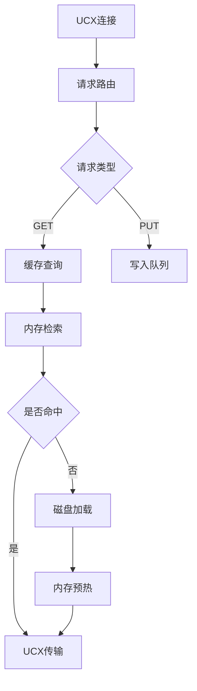
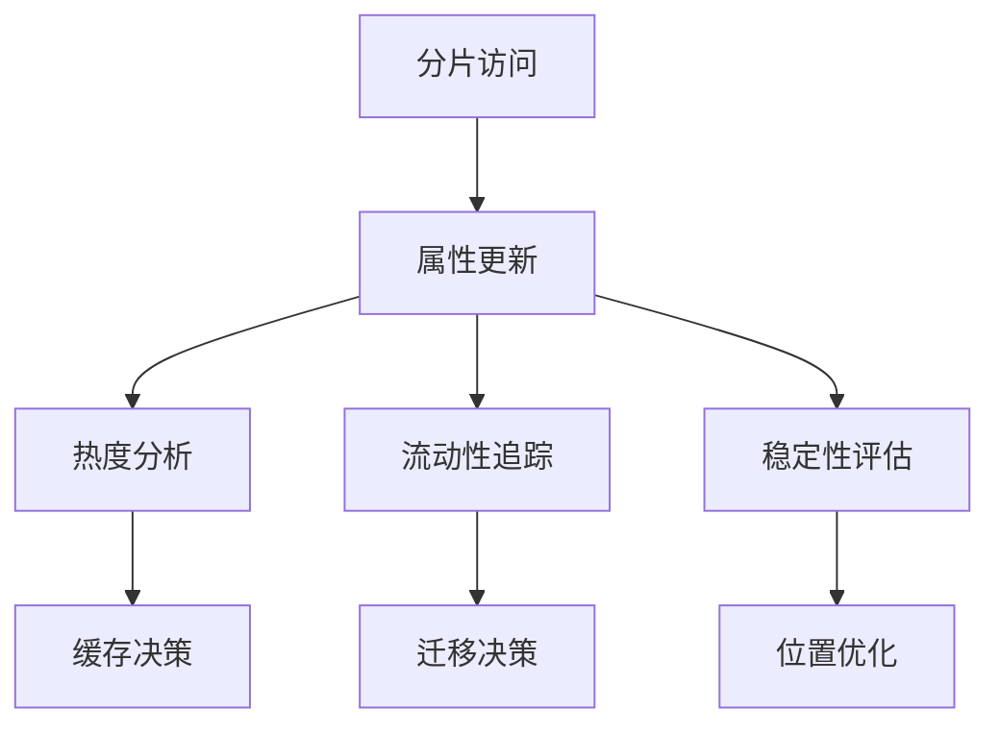
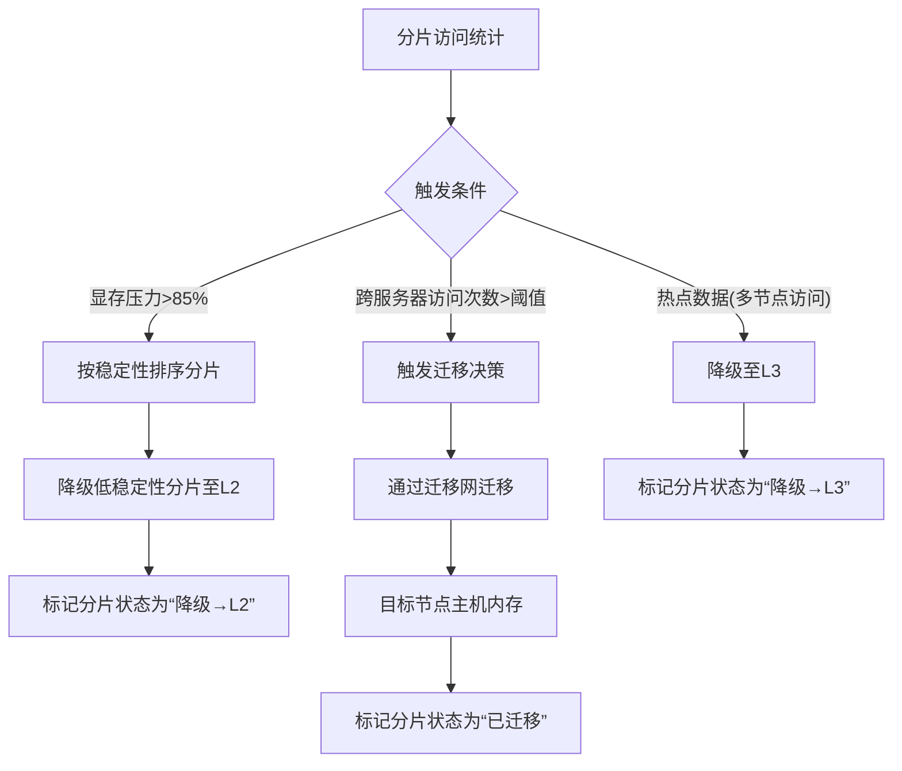
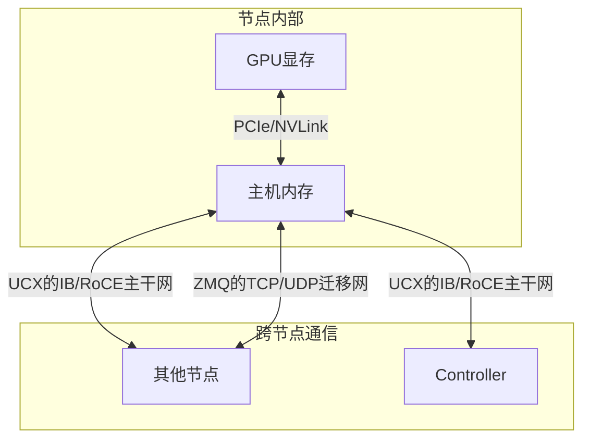
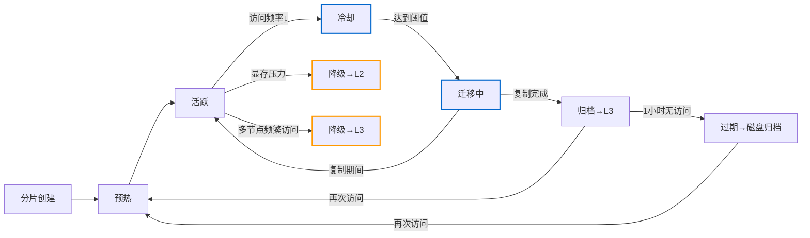
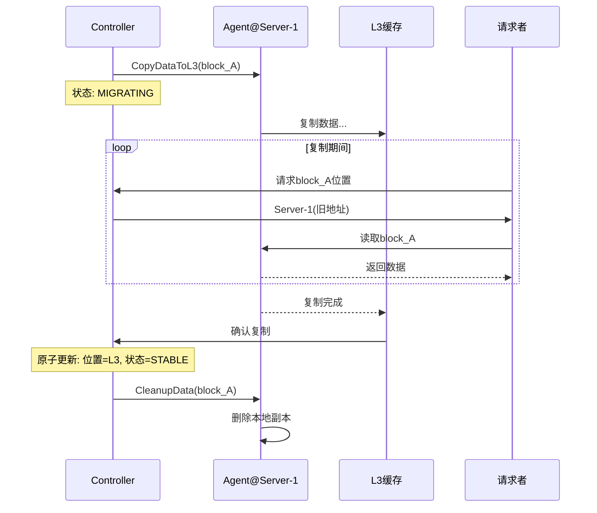
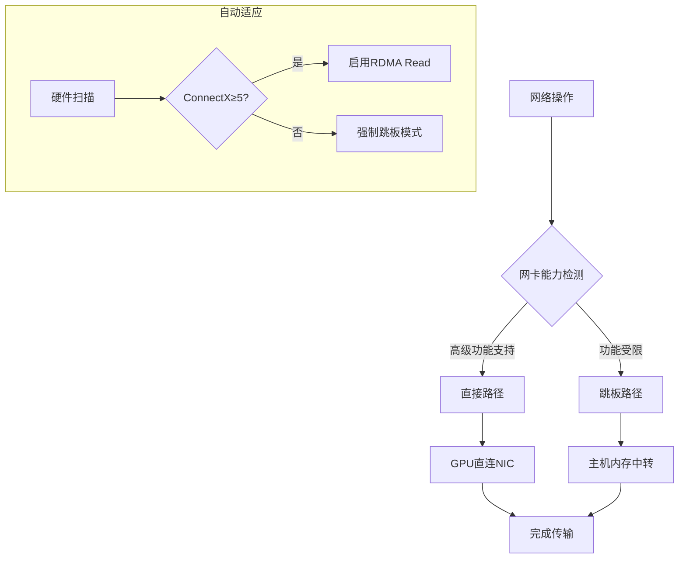

# Helios Calculation
一个内存中心式的、硬件感知的分布式 AI 计算平台

## 1. 架构定义 (Architecture Definition)


Helios Calculation 采用一种创新的内存中心式 (Memory-Centric) 架构，其核心是一个拥有海量内存和超高带宽的控制器 (Controller)，以及一组部署在高性能计算节点（如 IBM AC922）上的轻量级代理 (Agent)。

该架构将整个计算集群（包括 Controller 的内存）抽象为一个统一的、分层的内存资源池，并通过 Controller 主导的、基于数据特性的智能调度，为上层的大规模并行训练框架（如 Megatron-LM）提供极致的性能和无与伦比的稳定性。

其核心是分片元数据驱动的两层分布式模型：

- **宏观分布式** (Controller 分片元数据调度): Controller 作为唯一的“主宰”，负责将模型和数据在逻辑上切分，并分发给物理上分散的 NUMA 容器。
- **微观分布式** (NUMA容器内分片执行): 在单个 NUMA 容器内部，Megatron-LM 框架负责对其管辖的多块 GPU 进行二次的、硬件层面的微观分布式。

### NUMA 容器生命周期 (NUMA Container Lifecycle)
Helios Calculation Agent 的核心职责是管理其所在节点上所有 NUMA 容器的完整生命周期。这个过程由 Controller 远程触发和协调，确保了资源分配的精确性和隔离性。

- **指令接收**: Agent 从 Controller 接收到一个启动容器的 RPC 请求，其中包含所有必要的参数。
- **镜像拉取**: Agent 调用本地的容器引擎（如 Docker/Podman），从指定的仓库拉取 Megatron-LM 运行环境镜像。
- **硬件绑定与启动**: Agent 根据指令中的参数，构造并执行一条精确的 docker run 命令，将容器实例严格地绑定在指定的硬件资源上。
- **状态监控**: 容器启动后，Agent 持续监控其健康状况、资源使用情况，并实时上报给 Controller。
- **生命周期管理**: Agent 负责容器的停止、重启和销毁，并清理相关资源。

## 2. 功能特性 (Features)
- **分片元数据调度体系** (核心特性)
  - 统一调度单元：分片元数据
  - 全生命周期管理：创建→预热→活跃→冷却→归档
- **元数据驱动决策** 
  - 基于热度/流动性/稳定性动态路由
  - 分片状态感知迁移
- **四层存储架构**:
  - **L1 缓存**: 节点内 GPU 显存，作为最高性能的稳定区
  - **L2 缓存**: 节点内 CPU 主机内存，用于存放高流动性数据
  - **L3 缓存**: Controller 内存池，全局共享的温/冷数据缓存
  - **L4 硬盘归档**: 长期未访问分片的持久化存储，释放内存资源
- **NUMA 为中心的资源管理**: 所有调度和资源绑定都以 serverId:numaId 为基本单位，确保极致的硬件亲和性。
- **无侵入集成**: Megatron-LM 只需调整加载路径与数据初始化流程，核心逻辑保持不变
- **数据特性感知调度**: 数据块被赋予“热度、温度、流动性、稳定性”等属性，策略引擎基于这些属性动态决定数据在三层缓存中的最佳驻留位置。
- **读写路径分离与动态路由**: 根据传输类型和数据特性，动态选择 UCX (低延迟) 或 ZMQ (高带宽) 等最优传输路径。
- **三层高性能网络架构**:
  - **数据主干网 (Data Backbone)**: 基于UCX框架的IB/RoCE主干网，Controller端配置海量带宽（如10x双口100G），各计算节点配置标准带宽（1x双口100G）。专用于L3缓存服务，通过智能路由实现流量优化。
  - **数据迁移网 (Migration Fabric)**: 基于每个 NUMA 节点专属的 200G TCP/UDP 网卡，构建跨服务器的 L2 缓存（主机内存）数据迁移通道，完全旁路 Controller，极大降低其网络负载。
  - **管理网 (Management Plane)**: 基于低带宽的 2.5G RJ45 网口，负责心跳、遥测、评分等轻量级控制信令，确保核心数据网络不受干扰。
- **服务化与解耦**: Agent/Controller/CLI 职责分离，Controller 内部亦可进一步拆分为调度、状态管理、缓存等微服务。
- **统一管理界面**: 提供 Web UI 和独立的本地管理 CLI，兼顾全局监控与本地精细化调试。

## 3. 关键功能原理 (Key Mechanisms Explained)
### 3.1 Controller 主导的分布式初始化
#### 3.1.1 模型切片实现
- **集成Megatron-LM分区逻辑**：Controller加载完整模型后调用Megatron-LM的tensor/pipeline并行算法进行切片
- **分片元数据生成**：为每个分片创建包含偏移量、大小和校验和的元数据
- **分层存储**：切片结果存储在L3缓存服务中，按NUMA节点优化分布

#### 3.1.2 身份分配机制
- **全局rank生成**：创建唯一的三元组标识(PP_RANK, TP_RANK, DP_RANK)
- **容器启动指令**：通过Cap'n Proto RPC发送包含rank信息和L3地址的启动命令
- **环境变量注入**：Agent在启动容器时注入分布式角色参数

#### 3.1.3 数据拉取协议
- **请求格式**：包含全局rank和分片ID的ShardRequest
- **响应内容**：返回分片数据+校验和的ShardResponse
- **传输优化**：使用UCX-RDMA协议减少CPU开销

#### 3.1.4 L3缓存服务


#### 3.1.5 容错机制
- **分片校验**：CRC32校验和验证数据完整性
- **自动重试**：最多3次重传失败分片
- **故障恢复**：容器异常时重新调度并拉取相同分片

二次分布式: Megatron-LM 在容器内部，将拉取到的模型分片，利用其原生能力，进一步分发到其管辖的多块 GPU 显存中。

### 3.2 分片元数据驱动的智能调度
这是 Helios Calculation 智能调度的核心。Controller 为每个分片元数据维护一组动态属性，策略引擎基于这些属性进行调度决策和生命周期管理：



- **最后访问时间 (last_access)**: 记录分片最后一次被访问的Unix时间戳
- **热力评分 (HeatScore)**: 统一评分机制，计算公式：  
  $$
  \text{HeatScore}_i = \alpha \cdot \frac{N_i}{T} + \beta \cdot e^{-\frac{(t_{\text{now}} - t_{\text{last}})}{\tau}}
  $$
  
  **参数说明**  
  | 符号 | 含义 | 示例取值 |
  |------|------|----------|
  | \(N_i\) | 分片 \(i\) 在时间窗口 \(T\) 内的访问次数 | 37 次 |
  | \(T\) | 统计窗口（单位：秒） | 300 秒（5分钟） |
  | \(t_{\text{now}}\) | 当前时间（Unix时间戳） | 1721780000 |
  | \(t_{\text{last}}\) | 分片上一次被访问的时间 | 1721779980 |
  | \(\tau\) | 时间衰减常数（"保温时间"） | 120 秒 |
  | \(\alpha\) | 热度权重系数 | 0.7 |
  | \(\beta\) | 温度权重系数 | 0.3 |
  
  **公式解释**  
  - 第一项 \(\frac{N_i}{T}\)：单位时间内的访问频率（"热度"）
  - 第二项 \(e^{-\frac{(t_{\text{now}} - t_{\text{last}})}{\tau}}\)：上次访问的"新鲜度"（"温度"）
  - 两者线性组合形成统一的HeatScore，兼顾访问频率和时效性
  
  **调优建议**  
  | 场景 | 调整方向 |
  |------|----------|
  | 高频访问但不最近 → 权重偏向热度 | \(\alpha=0.9, \beta=0.1\) |
  | 关注最新数据 → 权重偏向温度 | \(\alpha=0.4, \beta=0.6\) |
  | 需要缓解频繁迁移 | 增大 \(\tau\) |
  
  **计算示例**  
  给定参数：
  - \(N_i = 20\)（5分钟内访问20次）
  - \(T = 300\) 秒
  - \(t_{\text{now}} = 1721780000\)
  - \(t_{\text{last}} = 1721779900\)（100秒前）
  - \(\tau = 120\)
  - \(\alpha = 0.7, \beta = 0.3\)
  
  计算过程：
  - 热度部分：\(\alpha \cdot \frac{N_i}{T} = 0.7 \cdot \frac{20}{300} = 0.7 \cdot 0.0667 \approx 0.0467\)
  - 温度部分：\(\beta \cdot e^{-\frac{(t_{\text{now}} - t_{\text{last}})}{\tau}} = 0.3 \cdot e^{-\frac{100}{120}} = 0.3 \cdot e^{-0.833} \approx 0.3 \cdot 0.434 \approx 0.130\)
  - 热力评分：\(\text{HeatScore} \approx 0.0467 + 0.130 = 0.1767\)
  
  此值可用于缓存层级分配（L1/L2/L3）和迁移触发判断。
- **流动性 (Fluidity)**: 记录分片迁移次数
- **稳定性 (Stability)**: 多维评分(频率×模式×时间)

**分片稳定区与双重阈值策略**:
- **高水位 (>85%)** 
  当L1显存利用率过高时，触发迁移机制：
  - 按稳定性评分排序分片
  - 将低稳定性分片"驱逐"到L2/L3
  - 更新分片元数据状态为"已降级"

- **低水位 (<70%)**
  当L1显存利用率较低时：
  - 扫描L2/L3中高热度分片
  - 预取满足条件的分片到L1
  - 更新分片元数据状态为"已预热"

### 3.3 跳板机制与分片优化 (Plank Mechanism & Shard Optimization)
Helios-Calculation 的网络架构针对分片元数据访问实施智能优化策略：

#### 读写分离策略
- **直接读取（Read-Only）**  
  当容器需要从远端L3缓存获取数据时：
  - 使用IB/RoCE主干网（UCX）通道（GPUDirect RDMA）
  - 保持低延迟的同时最大化高速互连带宽
  
- **写入/更新（Write-Back）**  
  数据回写场景：
  - 使用IB/RoCE主干网（UCX）上行通道保证快速提交与一致性
  - 支持批量聚合写入减少网络请求

#### 迁移优化（Migration via Plank）
为缓解IB/RoCE主干网（UCX）压力：

- **迁移触发条件**:
  - 跨服务器分片访问次数在时间窗口内超过阈值
  - 热点数据检测（同一分片多容器频繁访问）
  
- **迁移执行**:
  - 通过迁移网将数据迁移到目标节点主机内存
  - 标记原分片状态为"已迁移"
  - 后续访问直接使用本地内存副本
> **优化迁移说明**  
> - **降级→L2**: 当分片被其他服务器频繁访问时，系统将其预迁移到访问节点的主机内存（L2）。这种预迁移避免了频繁的跨网络跳板操作或占用IB/RoCE主干网（UCX）。
> - **降级→L3**: 当分片同时被多个跨服务器节点频繁访问时（通常≥3节点），系统将绕过常规冷却流程，直接将其迁移至L3全局缓存。这种网络优化迁移可减少单节点的网络压力。
> 
> **降级机制特点**:
> 1. 降级操作独立于冷却机制，权限优先级高于冷却
> 2. 降级触发仅基于访问频率，不考虑分片当前状态
> 3. L2降级优化单节点访问，L3降级优化多节点访问
#### 阈值策略与回收
- **动态阈值调整**:  
  根据网络负载实时计算迁移阈值：  
  `阈值 = 基础值 × (1 + 当前IB/RoCE主干网（UCX）利用率/100)`
  
- **分片回收机制**:
  - 当分片访问者分散在多个跨服务器NUMA容器时
  - 控制器下发回写命令，将分片迁回L3存储
  - 避免频繁迁移造成的网络抖动

### 3.4 UCX/ZMQ分层网络架构
Helios Calculation 采用UCX(Unified Communication X)框架重构通信层，严格遵循分层网络隔离策略：



- **节点内部交互 (L1↔L2)**:
  - 无网络需求，通过PCIe/NVLink直连
  - 延迟：<1μs，带宽：>100GB/s

- **L2↔L2 跨节点交互**:
  - 读路径：UCX的IB/RoCE主干网（自动选择最优协议）
  - 写路径：ZMQ协议的TCP/UDP迁移网（高带宽）
  - 典型场景：降级迁移到其他节点L2

- **L2↔L3 交互**:
  - 统一使用IB/RoCE主干网（UCX）
  - 读操作：UCX-RDMA协议
  - 写操作：UCX-Tagged Message协议
  - 典型场景：降级/冷却到L3

- **网络选择原则**:
  - 读操作无条件选择最低延迟路径（UCX自动优化）
  - 写操作无条件选择最高带宽路径（ZMQ用于迁移网，UCX用于主干网）
  - 迁移操作继承写路径网络选择
  - 智能路由：UCX根据硬件能力自动选择直接路径或跳板路径（详见3.7节）

### 3.5 UCX协议下的分片状态迁移
Controller 监控分片状态并执行生命周期管理，严格遵循UCX/ZMQ网络架构：



- **迁移路径与网络接口**:
- **降级→L2 (橙色)**:
    - 触发：显存压力/多节点访问
    - 网络：TCP/UDP迁移网（ZMQ）
    - 接口：跨节点L2↔L2写通道
    - 目标：目标节点主机内存
    
  - **降级→L3 (橙色)**:
    - 触发：≥3节点频繁访问
    - 网络：IB/RoCE主干网（UCX）
    - 接口：L2↔L3写通道
    - 目标：Controller内存池
    
  - **冷却迁移 (蓝色)**:
    - 触发：访问频率低于阈值
    - 网络：IB/RoCE主干网（UCX）
    - 接口：L2↔L3写通道
    - 目标：Controller内存池
    
- **状态转换规则**:
  - **预热**: 新分片加载到最近访问节点
  - **活跃**: 高频访问分片保持在L1/L2
  - **冷却**: 低频访问分片标记为迁移候选
  - **迁移中**: 分片正在迁移中，旧副本仍可读（详见3.6节）
- **降级→L2**: 当分片被其他服务器频繁访问时，通过TCP/UDP迁移网预迁移到目标节点主机内存
- **降级→L3**: 当分片被≥3节点频繁访问时，通过IB/RoCE主干网（UCX）直接降级至L3
- **冷却迁移**: 通过IB/RoCE主干网（UCX）迁移到L3

> **显存压力说明**  
> 显存压力指GPU显存资源紧张的状态。当L1缓存(GPU显存)利用率超过高水位阈值(>85%)时，系统会触发以下机制：  
> 1. 按稳定性评分排序分片  
> 2. 将低稳定性分片"驱逐"到L2  
> 3. 更新分片元数据状态为"已降级"  
> 
> **分片降级说明** 
> 1. 降级操作独立于冷却机制，权限优先级高于冷却
> 2. 降级触发仅基于访问频率（跨服务器访问）
> 3. L2降级是预迁移操作：先将数据迁移到目标节点主机内存
>    - TCP/UDP迁移网络无法直接从GPU显存取数
>    - 需要先将数据迁移到CPU主机内存
>    - GPU可直接读取主机内存，避免频繁跨网络跳板操作
> 4. L3降级优化多节点频繁访问场景
> 5. 所有降级操作通过四阶段协议实现服务零中断（详见3.6节）


### 3.6 UCX协议下的无缝迁移实现
基于UCX框架重构迁移协议，实现硬件感知的数据重定位：

#### 核心原则
- **先复制后清理**：复制完成前保持旧副本可读
- **原子元数据切换**：确保位置信息一致
- **状态机管理**：明确迁移生命周期

#### 四阶段流程


#### 阶段详解
1. **决策与准备**
   - 触发：迁移网带宽持续超阈值
   - 操作：
     - 状态更新为`MIGRATING_TO_L3`
     - 发送`CopyDataToL3`指令

2. **数据复制与网络选择**
   - **节点内部迁移 (L1→L2)**:
     - 无网络传输，内存直接拷贝
     - 延迟：<100ns
     
   - **跨节点L2迁移**:
     - 网络：TCP/UDP迁移网（200G ZMQ）
     - 协议：批量压缩传输
     
  - **L2→L3迁移**:
    - 网络：IB/RoCE主干网（100G UCX）
    - 协议：分片流式传输
    
  - **读请求处理**:
    - 查询返回旧位置
    - 源节点通过UCX-RDMA协议持续服务读请求
    - 迁移完成后自动切换新位置

3. **原子切换与确认**
   - 目标存储完成CRC校验后发送确认
   - Controller原子更新元数据：
     - 降级迁移：更新位置为L2/L3
     - 冷却迁移：更新位置为L3
     - 状态更新为`STABLE_WARM_L2`或`STABLE_WARM_L3`

4. **清理旧副本**
   - 发送`CleanupData`指令
   - 源节点删除副本释放资源

## 4. Megatron-LM 调度与执行工作流
本章节详细描述一个 Megatron-LM 训练任务从提交到执行的完整生命周期，并阐明各组件的具体职责。

### 步骤 1: 任务提交 (Job Submission)
**执行者**: 用户  
**接口**: Web UI 或 RESTful API  
**操作**: 用户提交一个训练/推理任务
1. **可视化任务配置**:
   - 提供交互式界面，直接编辑YAML配置文件
   - 实时验证参数有效性并提供提示
   - 可视化展示模型架构和参数规模（根据配置生成示意图）
2. **配置模板管理**:
   - 支持保存/加载常用配置模板
   - 提供参数优化建议（基于历史任务数据）
   
例如：

```yaml
jobName: gpt3-175b-training
model:
  name: gpt3
  size: 175B
dataset:
  path: /path/to/my/dataset
parallelism:
  pipeline_parallel_size: 8
  tensor_parallel_size: 8
  data_parallel_size: 16
dockerImage: registry.my-company.com/megatron-lm:latest
```

### 步骤 2: Controller 调度决策 (Scheduling Decision)
**执行者**: Helios Calculation Controller (调度器服务)  
**操作**:
- **资源计算**: Controller 解析任务配置，计算出总共需要的 NUMA 容器数量 (e.g., 8 * 8 = 64 个流水线/张量并行实例)。
- **拓扑感知分配**: 调度器查询集群状态，寻找满足 64 个空闲 NUMA 槽位的物理服务器组合。它会优先将流水线并行 (Pipeline Parallel) 的各个阶段放置在不同的服务器上，以最大化网络隔离；同时将张量并行 (Tensor Parallel) 的实例放置在同一台服务器的不同 NUMA 节点上，以利用 X-Bus。
- **生成执行计划**: 调度器生成一个详细的执行计划，该计划为 64 个容器中的每一个都分配了唯一的全局 Rank、角色（PP Rank, TP Rank 等）、以及它将被部署到的物理位置 (serverId:numaId)。

### 步骤 3: Agent 执行容器化 (Container Execution)
**执行者**: Helios Calculation Agent  
**操作**:
- **接收指令**: 每个被选中的 Agent 从 Controller 接收到一个或多个启动容器的 RPC 指令。
- **构造命令**: Agent 根据指令，为每个容器构造一个精确的 docker run 命令。

**示例命令**:
```bash
docker run -d --rm \
  --gpus '"device=0,1,2,3"' \
  --cpuset-cpus="0-19" \
  --memory="256g" \
  --network=host \
  --ipc=host \
  --ulimit memlock=-1 \
  -e GLOBAL_RANK=5 \
  -e PIPELINE_PARALLEL_RANK=0 \
  -e TENSOR_PARALLEL_RANK=5 \
  -e DATA_PARALLEL_RANK=0 \
  -e CONTROLLER_L3_CACHE_ADDRESS="rdma://10.0.0.1:5000" \
  -v /path/to/shared/data:/data \
  registry.my-company.com/megatron-lm:latest
```

**参数解释**:
- `--gpus`: 精确指定分配给此 NUMA 容器的 GPU 设备。
- `--cpuset-cpus`: 将容器进程严格绑定到此 NUMA 节点对应的 CPU 核心上。
- `--memory`: 限制容器可使用的主机内存。
- `--network=host`: 使用主机网络模式，以获得最低的网络延迟，方便 RDMA 和 ZMQ 通信。
- `-e ...`: 注入所有必要的环境变量，告知容器其在分布式训练中的角色。

### 步骤 4: 训练启动与监控 (Training & Monitoring)
**执行者**: Megatron-LM 容器 & Helios Calculation Agent  
**操作**:
- **分片元数据拉取**: 容器内的 Megatron-LM 进程启动后，根据环境变量连接 Controller L3 缓存，拉取属于自己的分片元数据。
- **二次分布式**: Megatron-LM 将模型分片加载到分配给它的多块 GPU 显存中。
- **开始训练**: 所有容器准备就绪后，开始协同进行分布式训练。
- **状态上报**: Agent 持续监控容器的运行状态（运行中、失败、完成）、GPU/CPU利用率，并通过管理网络将这些遥测数据上报给 Controller。

## 5. 建议目录树 (Proposed Directory Structure)
```plaintext
/Helios Calculation-platform
|
├── api/                      # Cap'n Proto 协议定义文件
|   └── v1/                   # API 版本控制
|       └── Helios Calculation.capnp
|
├── cmd/                      # 所有可执行程序的入口
|   ├── Helios Calculation-controller/    # Controller 服务主程序
|   ├── Helios Calculation-agent/         # Agent 服务主程序
|   └── Helios Calculation-cli/           # 本地管理 CLI 工具主程序
|
├── pkg/                      # 可被外部应用引用的公共库
|   ├── log/                  # 日志库
|   ├── config/               # 配置加载库
|   └── rpc/                  # RPC 客户端/服务端封装
|
├── internal/                 # 项目内部私有代码
|   ├── agent/                # Agent 服务的内部实现
|   |   ├── monitor/          # 硬件监控模块 (CPU, GPU, Network)
|   |   ├── executor/         # 容器执行与生命周期管理
|   |   └── server/           # Agent 的 RPC 服务端实现 (for Controller & CLI)
|   |
|   ├── controller/             # Controller 服务的内部实现
|   |   ├── scheduler/          # 调度器核心算法
|   |   ├── policy/             # 策略引擎 (数据迁移, 冷却等)
|   |   ├── state/              # 集群状态管理器
|   |   ├── metadata/           # 数据块元数据存储接口
|   |   ├── transport/          # 传输服务，协调网络路径
|   |   ├── partitioning/       # 模型切片模块
|   |   └── l3_service/         # L3缓存服务实现
|   |
|   ├── services/               # 作为独立微服务运行的组件
|   |   ├── l3_cache_service/   # L3 共享缓存服务 (RDMA K-V Store)
|   |   └── web_api_service/    # Web UI 的后端 API 服务
|   |
|   └── common/                 # 项目内部共享的工具和定义
|       ├── types/              # 核心数据结构定义
|       └── utils/              # 通用工具函数
|
├── deploy/                   # 部署相关的文件
|   ├── docker/               # 用于构建 Megatron-LM 容器的 Dockerfile
|   └── configs/              # 生产环境配置文件模板
|
├── web/                      # Web UI 前端代码 (React/Vue)
|
├── scripts/                  # 编译、测试、部署等辅助脚本
|
└── README.md                 # 本文档
```

### 3.7 硬件适配规范与跳板机制

**CX-4网卡能力矩阵**：
| 特性 | 支持状态 | 性能影响 | 解决方案 |
|------|----------|----------|----------|
| GPU→NIC RDMA Write | ✅ 稳定支持 | 延迟≤1.5μs | IB/RoCE主干网（UCX） |
| NIC→GPU RDMA Read | ⚠️ 平台依赖 | +0.5-1μs延迟 | TCP/UDP迁移网（ZMQ） |
| GPU Peer-to-Peer | ❌ 不支持 | N/A | NUMA优化 |
| PCIe Gen4 | ❌ 不支持 | 最大64Gbps | 链路聚合 |
| 动态重绑定 | ❌ 不支持 | 手动配置 | 静态绑定 |
| Unified Memory | ⚠️ CUDA≥11.4 | 带宽降30% | 选择性启用 |

**跳板机制核心逻辑**：


**路径选择原则**：
1. **写操作(GPU→NIC)**：
   - 无条件使用直接路径
   - 最大化利用GDR优势
   
2. **读操作(NIC→GPU)**：
   - 检测网卡型号和驱动
   - ConnectX-5及以上：尝试直接路径
   - ConnectX-4及以下：强制跳板路径
   - 失败时自动降级

**UCX统一抽象层**：
- 提供一致API接口
- 内部自动路由选择
- 实时性能监控
- 无缝支持硬件升级

## 6. 核心技术验证指标 (Core Technology Validation Metrics)
- **Numa 路径管理**:
  - 跨节点 UCX 调度: 验证 Controller 能否根据拓扑和数据特性，正确发起 GDR-to-GDR 或基于跳板的传输。
  - 动态路径决策: 验证系统能否根据读/写类型和数据大小，自动选择 UCX 或 ZMQ 路径。
  
- **智能数据迁移**:
  - 高频数据本地化: 验证被频繁访问的远程数据块，是否能被策略引擎自动迁移到计算任务所在的 NUMA 节点。
  - 流动性感知: 验证高流动性数据是否被优先保留在 L2 主机内存而非 L1 显存。
  - 双重阈值稳定区管理: 验证在显存利用率 >85% 和 <70% 时，能否正确触发数据的驱逐和预取机制。
  - **跳板机制验证**:
    - CX-4环境强制跳板路径执行率100%
    - CX-6环境直接路径执行率≥95%
    - 故障时自动降级成功率100%
  
- **性能基准**:
  - 读路径 (UCX): 
    - CX-4：延迟≤2.2μs
    - CX-6：延迟≤1.2μs
  - 写路径 (ZMQ): 验证大文件传输带宽是否能逼近物理网卡上限 (如 >20GB/s for 200G NIC)。
  - **跳板路径性能**:
    - 中转延迟增加≤0.8μs
    - 带宽损耗≤15%
